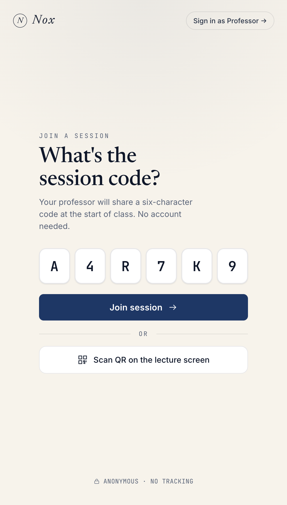
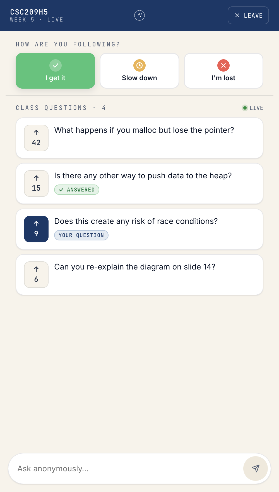
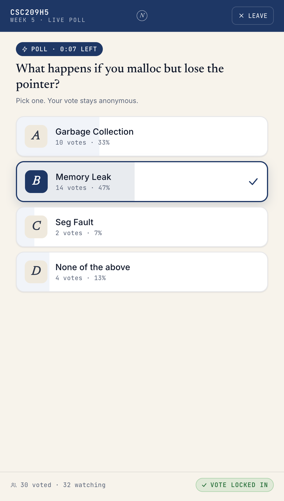
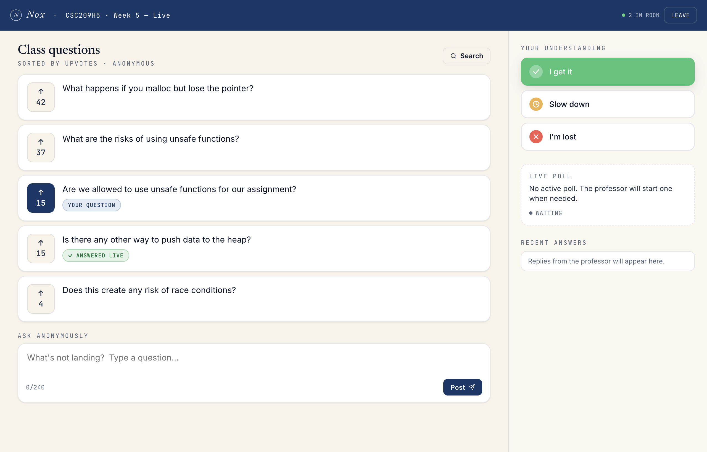
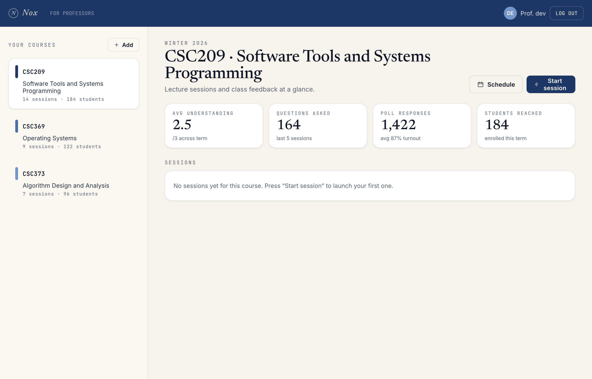
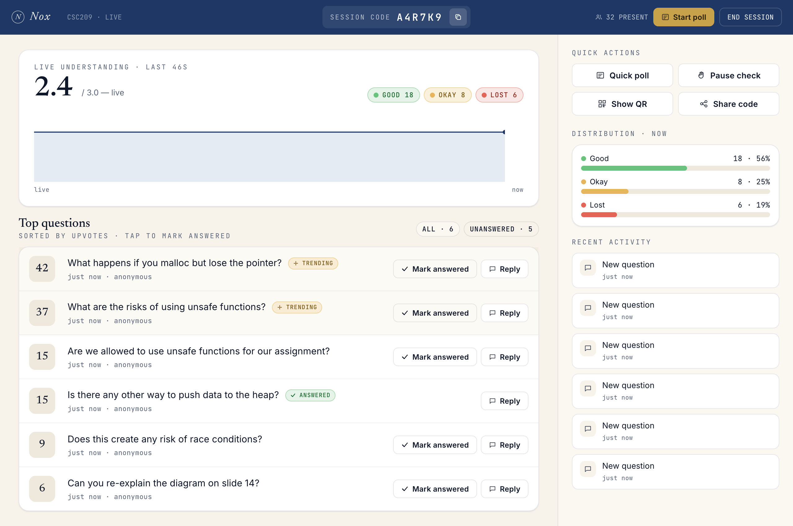
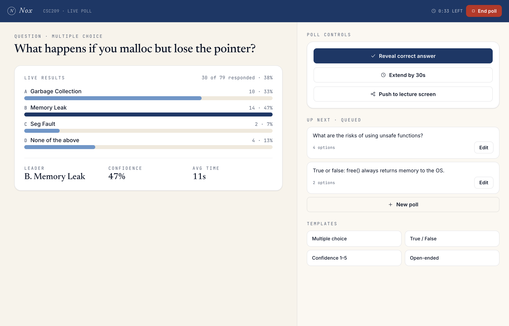
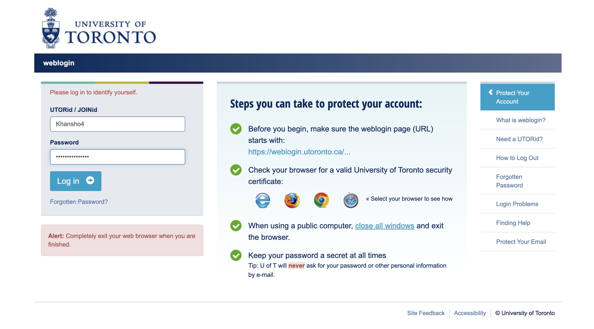

<div align="center">



# Nox

**Real-time, anonymous Q&A and polling for lectures.**

</div>

---

Nox closes the gap between the front of the room and the back. Students ask without raising their hand, vote on each other's questions, and signal in real time how the lesson is landing. Instructors see the room as it actually is — not how it looks.

- **Anonymous Q&A** with upvotes — the best questions surface, no one is on the spot.
- **Live understanding pulse** — three taps (*I get it · Slow down · I'm lost*) keep instructors honest in real time.
- **Quick polls** — multiple choice, true/false, confidence 1–5, or open-ended; results animate in as students vote.
- **Zero account for students** — type a six-character session code and you're in.
- **Single sign-on for instructors** through the institution's existing weblogin. No new credentials.

---

## Screens

### Student · Mobile

|  |  |  |
|---|---|---|
|  |  |  |
| Six-character code, QR fallback, no account. | Three-mood pulse, upvote-sorted Q&A, anonymous composer. | Large lettered tap targets and an animated lock-in. |

### Student · Web

The same flow with a side rail for understanding, the active poll, and instructor replies.



### Instructor · Desktop



> **Sessions** — every course at a glance. Per-session sparklines, term-level stats, one click to start the next live session.



> **Live dashboard** — pulse timeline, distribution panel, top-questions feed with reply and mark-answered, and a heads-up when comprehension dips.



> **Live poll** — animated results, leader and confidence stats, queued polls, template library.

### Authentication

Single sign-on through the institution's existing weblogin. SSO behaviour is unchanged.



---

## Design system

```
Primary  #1E3765    U of T navy
Paper    #F7F3EB    warm parchment canvas
Ink      #0F1729
Accents  oklch good · okay · low (semantic, equal-chroma)
Type     Newsreader · Inter · JetBrains Mono
```

Reusable React primitives — `Btn`, `Card`, `Pill`, `NoxTopBar`, `PulseLine`, `PollBars`, `SectionLabel` — live in [`general_client/src/components/ui/`](general_client/src/components/ui/). Tokens are CSS custom properties in [`general_client/src/styles/tokens.css`](general_client/src/styles/tokens.css).

---

## Architecture

```
Browser (React · Redux)
  ├── REST  ── /nox/api/{sessions,records,professor,student}
  └── WS    ── socket.io (rooms keyed by session code)
                │
                ▼
        Express + socket.io
                │
                ▼
            MongoDB (sessions · records · polls · students · professors)
```

REST + sockets, room-scoped per session. Pulse aggregates server-side at 1 Hz; questions, votes, and poll updates fan out instantly. Identity is cookie-based for both instructors (`pid`, set by the SSO handshake) and students (`sid`, anonymous, set on first join) — the server never trusts identity claims sent in request bodies, and one-vote-per-student is enforced server-side on every question and poll.

---

<div align="center">
<sub>Built to listen.</sub>
</div>
